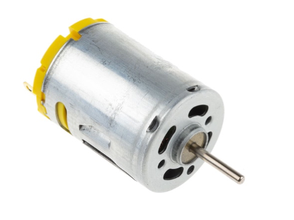

# Der Gleichstrommotor (DC-Motor)

<div align = "center">
<table>
  <thead>
    <tr>
      <th align = "center">Titel</th>
      <th align = "center">Autor</th>
      <th align = "center">Stand</th>
    </tr>
  </thead>
  <tbody>
    <tr>
      <td align = "center">Der Gleichstrommotor (DC-Motor)</td>
      <td align = "center">Logan Weigoldt</td>
      <td align = "center">12.05.2023</td>
    </tr>
  </tbody>
</table>
</div>

<div align = "center">
  
<p><i>DC-Motor</i></p>
</div>

[^1]

## Table of Contents

- [1. Funktionsweise eines DC-Motors](#1-funktionsweise-eines-dc-motors)
- [2. Erklärung zum Code](#2-erklärung-zum-code)

---

## 1. Funktionsweise eines DC-Motors

- Der DC-Motor besteht vereinfacht aus einem Rotor und einem Stator und wird bei uns mithilfe eines zusätzlichen Chips gesteuert.
- Der Stator besteht aus feststehenden Magneten, während der Rotor aus beweglich gelagerten Spulen besteht.
- Wenn an die Spulen Strom angelegt wird, entsteht ein Magnetfeld, wodurch sich Rotor und Stator abstoßen und der Rotor und die damit verbundene Achse sich drehen.
- Der Strom kann allerdings nicht ununterbrochen anliegen, da der Stator sich sonst einpendeln und nicht mehr bewegen würde.
- Deshalb wird der Strom innerhalb kürzester Zeit abwechselnd an und aus gestellt wird.
- Durch die Zeitabstände zwischen dem Ein- und Ausschalten lässt sich die Geschwindigkeit steuern.

## 2. Erklärung zum Code

Zuallererst werden die Anschlüsse für Motor Vorwärts (`MLV`), Motor Rückwärts (`MLR`) und die Stromüberwachung am Motor festgelegt.

```C++
#define MLV 2        
#define MLR 3
#define MM A0
```

Im nächsten Schritt werden die Konstanten für die Pulsweite und Beschleunigung des Motors angelegt,

```C++
const int pwmFq=100;  
const int beschl=10;			
```

außerdem die Geschwindigkeit, die der Motor erreichen soll und die Geschwindigkeit, die er tatsächlich besitzt, zudem eine Variable für die Messwerte am Motor und eine Boolean-Variable, welche anzeigt, ob die Beschleunigung abgeschlossen ist.

```C++
int motorSoll = 0;    
int speedL = 0;     
int motMess;          
boolean motFertig = true;
```

Im Setup für den Motor werden `MLV` und `MLR` auf Ausgabe gestellt.

```C++
void motSetup(){
  pinMode(MLV,OUTPUT);  pinMode(MLR,OUTPUT);
}
```

Mit der Funktion `motFahre()` wird der Motor auf die Sollgeschwindigkeit (`sollL`) beschleunigt, indem Soll- und Istgeschwindigkeit miteinander verglichen werden. 

Sobald der Beschleunigungsvorgang abgeschlossen ist, wird das mithilfe von motFertig festgehalten.

```C++
void motFahre(int sollL){
  static long timer;  
  if(millis()>timer+beschl){
    timer=millis(); 
    if(sollL>speedL) speedL++;
    if(sollL<speedL) speedL--;
    if(sollL==speedL) motFertig=true; else motFertig=false; 
  }
}
```

Mit der Funktion motLi wird der Motor aktiviert. Zuerst werden Variablen für Zeitmessung, (`timer`, `pwmTime`), Richtung (`ri`) und Geschwindigkeit (`sp`) sowie `pwmPhase` festgelegt.

```C++
void motLi(){
  static long timer;        
  static byte pwmTime;      
  static boolean pwmPhase;  
  boolean ri;                
  int sp = speedL; 
```

Sobald der Timer für die Länge des PWM-Puls, dessen Länge durch die Variablen `timer`, `pwmTime` und `pqmFq` bestimmt wird, abgelaufen ist, wird das Vorzeichen der Geschwindigkeit in die Variable `ri` umgewandelt, wobei `ri=1` vorwärts und `ri=0` rückwärts bedeutet.

Danach wird das Vorzeichen gelöscht.

```C++
  if(micros()>timer+pwmTime*pwmFq){
    timer=micros();         
    if(sp<0) ri=1; else ri=0; 
    sp=abs(sp);
```

Falls der PWM-Puls “ein” ist, wird er nun auf “aus” geschaltet – die Ausgänge werden auf `LOW` gestellt, pwmPhase auf `false` und die Pulsbreite für die aus-Phase wird mithilfe der verbliebenen der 256 Teile der Phase festgelegt.

```C++
    if (pwmPhase){            
      motMess = analogRead(MM);
      digitalWrite(MLV,LOW); digitalWrite(MLR,LOW);
      pwmPhase=false;         
      pwmTime=255-sp;
```
      
Umgedreht wird der PWM-Puls, falls er “aus” ist, auf “ein” gestellt, indem der Ausgang für Vorwärts eingeschaltet wird, wenn ri wahr ist und die Geschwindigkeit größer als Null, umgedreht für Rückwärts.

```C++
    } else {                  // PWM-Puls "Ein" - Ports einschalten
      if(ri && sp>0) digitalWrite(MLV,HIGH); 
      if(!ri && sp>0) digitalWrite(MLR,HIGH);
      pwmPhase=true;          // Phasenstatus "Ein" merken
      pwmTime=sp;             // Wecker für Ein-Zeit stellen
    }
  }
}
```

[^1]: https://res.cloudinary.com/rsc/image/upload/b_rgb:FFFFFF,c_pad,dpr_1.0,f_auto,h_758,q_auto,w_1350/c_pad,h_758,w_1350/F2389721-01?pgw=1&pgwact=1
