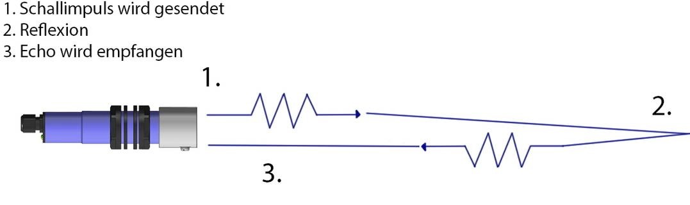
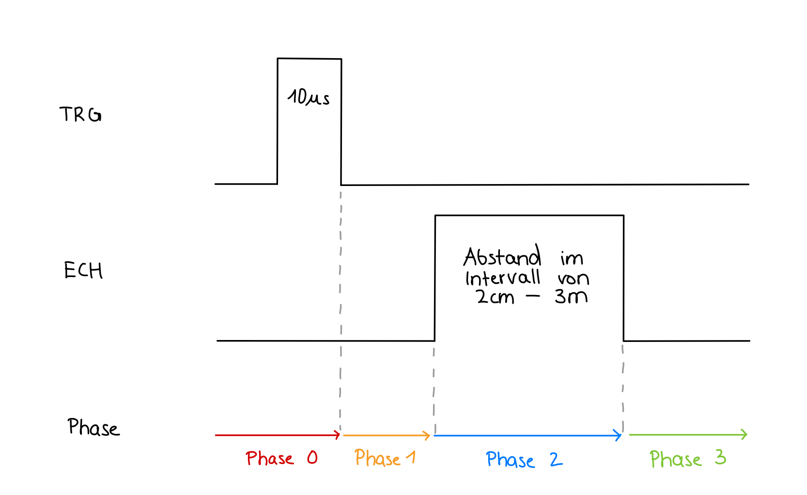

# Ultraschallsensor (HC-SR04) [^1]

<div align = "center">
<table>
  <thead>
    <tr>
      <th align = "center">Titel</th>
      <th align = "center">Autor</th>
      <th align = "center">Stand</th>
    </tr>
  </thead>
  <tbody>
    <tr>
      <td align = "center">Ultraschallsensor (HC-SR04)</td>
      <td align = "center">Maximilian Kautzsch</td>
      <td align = "center">12.05.2023</td>
    </tr>
  </tbody>
</table>
</div>

Im nachfolgenden Abschnitt erfolgt eine prägnante Darstellung der Funktion und Anwendung eines Ultraschallsensors. Des Weiteren wird die Integration desselben in den Roboter mittels der `HC-Sensor.h`-Datei erläutert.

<div align = "center">
  
<p><i>Technische Daten des HC-SR04</i></p>
</div>

## Table of Contents

- [1. Funktionsweise eines HC-Sensors](#1-funktionsweise-eines-hc-sensors)
- [2. Grundlegendes zur Datei "HC-Sensor.h"](#2-grundlegendes-zur-datei-hc-sensorh)
- [3. Erklärung zur Codestruktur "Timer"](#3-erklärung-zur-codestruktur-timer)
- [4. Festlegung der Ports sowie Initialisierung und Deklarierung der Variablen](#4-festlegung-der-ports-sowie-initialisierung-und-deklarierung-der-variablen)
- [5. hcSetup()](#5-hcsetup)
- [6. messSerie()](#6-messserie)
- [7. messHcR()](#7-messhcr)
- [8. messHcM() und messHcL()](#8-messhcm-und-messhcl)

---

## 1. Funktionsweise eines HC-Sensors 

- Mittels des Einsatzes von Ultraschallsensoren ist es möglich, die Distanz zwischen dem Sensor und einem Objekt im Bereich von 2 cm bis ungefähr 3 m mit einer Auflösung von 3 mm zu messen. [^2]
- Eine Stromaufnahme von unter 2 mA und eine Versorgungsspannung von 5 V sind zur Betreibung des Sensors erforderlich.
- Der Sensor emittiert einen Schallimpuls (**Trigger**), der sich mit Schallgeschwindigkeit durch die Luft zum Ziel bewegt. [^3]
- Sobald der Schallimpuls auf das Objekt trifft, wird er reflektiert. Das resultierende Echo wird vom Sensor erfasst (**Echo**) und anhand der Zeitdifferenz zwischen Aussenden und Empfangen des Schallsignals kann der Abstand zum Objekt berechnet werden.
- Jede Messung erfordert ein Zeitintervall von mindestens 20 ms.

<div align = "center">
  
<p><i>Funktionsweise eines HC-Sensors </i></p>
</div>

## 2. Grundlegendes zur Datei "HC-Sensor.h"

Die `HC-Sensor.h`-Datei ist zuständig für die vollständige Abwicklung des Messvorgangs mittels des Ultraschallsensors.
Die Einbindung dieser Datei in andere Programme erfolgt durch die Verwendung von `#include "HC-Sensor.h"`.

## 3. Erklärung zur Codestruktur "Timer"

Zur Vermeidung des `delay(n)`-Befehls mit einer Zeitdauer von `n` wird häufig der nachfolgende Codeblock genereller Struktur eingesetzt. Er kann in Verwendung mit `millis()` (Millisekunden) oder `mikros()` (Mikrosekunden) vorkomen.
```C++
static long timer;
if(millis() > timer + n) {
    timer = millis();
    ...         // (Code)
}
```
In diesem Beispiel erfolgt die Ausführung des Codes alle `n` ms.


## 4. Festlegung der Ports sowie Initialisierung und Deklarierung der Variablen

Im ersten Schritt ist es notwendig, beide Anschlüsse, nämlich Trigger (`TRG`) und Echo (`ECH`), für jeden einzelnen Sensor zu definieren. 
```C++
#define TRGL 4  // HC-SR04 Links Trig
#define ECHL 5  // HC-SR04 Links Echo
#define TRGM 6  // HC-SR04 Mitte Trig
#define ECHM 7  // HC-SR04 Mitte Echo
#define TRGR 8  // HC-SR04 Rechts Trig
#define ECHR 9  // HC-SR04 Rechts Echo
```

Darüber hinaus werden die globalen Variablen `startHC` und `readHC` (zum Auslesen der Distanz in cm) benötigt.

```C++
boolean startHcR = false; // set true: startet Messung für rechten HC-Sensor, read false: Messung fertig 
boolean startHcM = false; // set true: startet Messung für mittleren HC-Sensor, read false: Messung fertig 
boolean startHcL = false; // set true: startet Messung für linken HC-Sensor, read false: Messung fertig
```
```C++
int readHcR;              // Abstand auslesen in cm
int readHcM;              // Abstand auslesen in cm
int readHcL;              // Abstand auslesen in cm
```

## 5. hcSetup()

Innerhalb der Funktion `hcSetup()` erfolgt die Definition aller Trigger-Anschlüsse als Ausgänge und der Echo-Anschlüsse als Eingänge. Die Integration dieser Funktion in andere Programme geschieht im `setup()`, um somit eine direkte Initialisierung aller HC-Sensoren zu ermöglichen.
```C++
void hcSetup(){
  pinMode(TRGR, OUTPUT); pinMode(ECHR, INPUT);
  pinMode(TRGM, OUTPUT); pinMode(ECHM, INPUT);
  pinMode(TRGL, OUTPUT); pinMode(ECHL, INPUT);
}
```

## 6. messSerie()

Zu Beginn erfolgt die Deklaration der Variablen `timer` sowie der Hilfsvariable `zaehler`. Diese sind mit `static` gekennzeichnet, damit sie in anderen Funktionen ebenfalls verwendet werden können.

```C++
void messSerie(){
  static long timer;        // Wecker
  static int zaehler=0;     // Sensor-Zähler
```
Anschließend wird die bereits zuvor erläuterte [Timer-Struktur](#3-erklärung-zur-codestruktur-timer) verwendet. In diesem Fall wird alle 50 ms eine switch-case-Anweisung durchgeführt. Durch die Kombination mit der Zeile `zaehler++; if(zaehler>2) zaehler=0;` wird die aufeinanderfolgende Messung der drei HC-Sensoren beschrieben.

```C++
  if(millis()>timer+50){    // alle 50ms ein anderer Sensor
    timer=millis();         // Wecker neu stellen
    switch(zaehler){
      case 0: {if(startHcL==false) startHcL=true; break;}
      case 1: {if(startHcM==false) startHcM=true; break;}
      case 2: {if(startHcR==false) startHcR=true; break;}
    }
    zaehler++; if(zaehler>2) zaehler=0;
  }
}
```
Es erfolgt somit alle 50ms eine Messung durch einen anderen Ultraschallsensor zur Bestimmung der Distanz zwischen dem Roboter und einem Objekt.

## 7. messHcR()

### Deklaration und Initialisierung

Zunächst erfolgt die Definition und Deklaration einiger Variablen.

Dabei wurde der Name des Triggers, zuvor `TRGM`, zur besseren Lesbarkeit und Übersichtlichkeit in `TriggerPin` umbenannt. Ähnliches gilt für den Namen des Echos, zuvor `ECHM`, welcher nun als `EchoPin` bezeichnet wird.

```C++
void messHcM(){
  const int triggerPin=TRGM, echoPin=ECHM;
```

Zusätzlich müssen die Variablen `timer` als Hilfsvariable für die [Timer-Struktur](#3-erklärung-zur-codestruktur-timer), die `phase` der Pulsweitenmodulation sowie `startOld`, `messOld` und `messTab[8]` als statische Variablen benannt werden.

```C++
  static long timer;
  static int phase;
  static boolean startOld = false;
  static boolean messOld = false;
  static int messTab[8];            // Array für Gleitenden Durchschnitt
```

### Phasen der Messung

Die Abstandsmessung mittels eines Ultraschallsensors kann in mehrere Phasen unterteilt werden.

<div align = "center">
  
<p><i>Phasen der Messung</i></p>
</div>

### Phase 0

> [Idee](#phasen-der-messung): Es wird ein Schallpuls über den Trigger für eine Dauer von 10µs ausgesendet, danach wird der Trigger ausgeschaltet.

Wenn der gesamte Messzyklus über den rechten Ultraschallsensor gestartet werden soll, wird die Variable `startHcR` auf `true` gesetzt, wobei `startHcR` größer als `startOld` ist.

Bevor der Trigger den Schallimpuls aussendet, wird die Zeit für den Beginn der LH-Flanke des Pulses gespeichert.

`startOld` wird nun auf `startHcR` festgelegt, um den Startpegel zu merken.

``` C++
if(startHcR>startOld){               // Start der Messung erkennen: LH-Flanke
    timer=micros();                  // Zeit für Triggerpuls merken 
    digitalWrite(triggerPin, HIGH);  // Trigger einschalten
    startOld = startHcR;             // Messprozess nun aktiv, Startpegel merken
    phase = 0;                       // erste Phase: Trigger
  }
```
An dieser Stelle findet die [Timer-Struktur](#3-erklärung-zur-codestruktur-timer) Anwendung, wodurch eine Zeitverzögerung von 10 µs vor der Deaktivierung des `TriggerPin` und der darauf folgenden Einleitung der [Phase 1](#phase-1) abwartet wird.

```C++
switch (phase){
    case 0: {
      if(micros()>timer+10){                     // Trigger-Ende 10us abwarten
        phase=1; digitalWrite(triggerPin, LOW);  // Trigger abschalten und
      }                                          // Phase 1 einleiten: Warte auf Echo
      break;
    }
```

### Phase 1

> [Idee](#phasen-der-messung): Falls der Schallimpuls auf ein Objekt trifft, wird der Impuls reflektiert und der Sensor erzeugt ein Echoimpuls, welcher proportional zur Entfernung ist.

Wenn eine Flanke (LH-Flanke) des Echosignals `echoPin` auftritt, wird die [Phase 2](#phase-2) des Messprozesses eingeleitet. 

Hierbei werden die Zeit für den Beginn des Echos sowie der Echopegel gespeichert.

```C++
case 1: {
      if(digitalRead(echoPin)>messOld){  // Echostart abwarten: LH-Flanke
        phase=2; timer=micros();         // Zeit für Echo-Beginn merken
        messOld=HIGH;                    // Echopegel merken
      }                                  // Phase 2 abwarten: Echo-Ende
      break;
    }
```

### Phase 2

> [Idee](#phasen-der-messung): Sobald das Echo zu Ende ist, kann der Abstand vom Sensor zum Objekt aus der Zeitdifferenz zwischen Ende und Beginn des Echos berechnet werden.

Wenn der gemessene Pegel vom `EchoPin` kleiner ist als der Vorherige (`messOld`) (HL-Flanke), wird die [Phase 3](#phase-3) des Messzyklus eingeleitet und `messOld` auf false gesetzt.

```C++
case 2: {
      if(digitalRead(echoPin)<messOld){  // Echoende abwarten
        phase=3; messOld = LOW;          // Echo HL-Flanke erkannt, Phase inaktiv
```

Die Zeitdifferenz `tHelp` wird mithilfe der folgenden Gleichung berechnet:

<div align = "center">
  
</div>


```C++
        long tHelp = (micros()-timer)/2;
```

Wird festgestellt, dass die Zeitdifferenz unter 9000 µs liegt, also das Objekt weniger als 3 m entfernt ist, erfolgt die Berechnung der Entfernung des rechten HC-Sensors zum Objekt `readHcR` durch die folgende Formel:

<div align = "center">
  
</div>

Weil die Entfernung in cm ausgegeben werden soll, sind die Einheiten zu beachten:

<div align = "center">
  
</div>

Demzufolge muss man den Term des Abstandes mit 10.000 dividieren, um die entsprechende Einheit zu erhalten. Aufgrund der Tatsache, dass die Schallgeschwindigkeit im Medium Luft bei gleichbleibender Temperatur eine Konstante ist, lassen sich einige Vereinfachungen treffen:

<div align = "center">
  
</div>

<div align = "center">
  
</div>
<br>

```C++
        if(tHelp<9000) readHcR=tHelp/29.1; //else readHcR=0;
```

### Phase 3

> [Idee](#phasen-der-messung): Am Ende des Messzyklus wird die Messung als abgeschlossen signalisiert.

Die Variable `startHcR` wird auf den Wert `false` gesetzt, um zu signalisieren, dass die Messung fertig ist. Dieser Wert wird zur Erinnerung an den Startpunkt der nächsten Messung mit dem rechten Ultraschallsensor unter `startOld` gespeichert.

```C++
        startHcR = false;              // Messung fertig signalisieren
        startOld = startHcR;           // Startpegel merken für Neustart
      }
      break;
    }
  }
}
```

## 8. messHcM() und messHcL()

Die Struktur der Funktionen `messHcM()` für den mittleren HC-Sensor und `messHcL()` für den linken HC-Sensor ist analog zu der bereits erläuterten Funktion [messHcR()](#7-messhcr).

[^1]: https://res.cloudinary.com/rsc/image/upload/b_rgb:FFFFFF,c_pad,dpr_1.0,f_auto,h_758,q_auto,w_1350/c_pad,h_758,w_1350/Y2153181-01?pgw=1&pgwact=1
[^2]: https://www.waycon.de/produkte/ultraschallsensoren/messprinzip-ultraschallsensoren/
[^3]: https://www.waycon.de/fileadmin/ultraschallsensoren/Ultraschallsensor-Messprinzip.jpg
