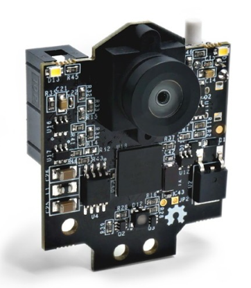

# Pixy2-Kamera

<div align = "center">
<table>
  <thead>
    <tr>
      <th align = "center">Titel</th>
      <th align = "center">Stand</th>
    </tr>
  </thead>
  <tbody>
    <tr>
      <td align = "center">Pixy2-Kamera</td>
      <td align = "center">12.05.2023</td>
    </tr>
  </tbody>
</table>
</div>

Die Kamera arbeitet mit 60fps, hat eine Auflösung von 316x208 Pixel und wird mit einem Flachbandkabel an den Arduino angeschlossen. 

Die Bibliothek zur Kamera mit Farberkennung haben wir von der [Pixycam-Website](https://pixycam.com/downloads-pixy2/) heruntergeladen und in die Arduino Umgebung als .zip Bibliothek eingebunden.
Ebenso haben wir den Pixy-Monitor auf den Rechnern installiert, um die Kamera anzulernen. Dies basiert auf den Farbton, den man vor die Kamera hält. Dabei sind einheitliche Farben und kräftige Farben wichtig. Auch hat das Umgebungslicht einen großen Einfluss, am besten ist es mit Tageslicht. Zu Fehlerkennungen führt das gepulste künstliche Licht. Das Anlernen der Farbe müssen wir also zum Wettberwerbstag nochmal aktualisieren.

<div align = "center">
  
<p><i>Pixy2-Kamera</i></p>
</div>

[^1]

## Table of Contents

- [1. Anlernen der Farbe](#1-anlernen-der-farbe)
- [2. Erklärung zum Code](#2-eindung-in-die-software-unseres-roboters)

---

## 1. Anlernen der Farbe

1.	Pixy2 Kamera an den Arduino schließen (Stromversorgung)
2.	Pixy2 einschalten, es erscheinen Lichtblitze – warten bis LED erlischt
3.	Taste oben auf Pixy2 gedrückt halten, es leuchtet nach 1 Sekunde die LED auf, erst weiß, rot, grün und weitere Farben. Wenn die LED rot wird, Taste loslassen, jetzt wechselt Pixy2 in den Erfassungsmodus.
4.	Farbobjekt vor die Kamera halten (15 cm – 50 cm).
5.	Nun muss man die Position des Farbobjektes variieren, sodass die Farberkennung optimiert werden kann. Dabei auf die LED achten, die umso heller leuchtet, je besser die Qualität der Erkennung ist. Kontrollieren kann man dies in der Monitorkonsole auf dem PC.
6.	Ist man mit einer Farbauswahl zufrieden, muss man dies an der Kamera per Kopfdruck bestätigen. Die Position „rot“ wurde nun angelernt.

Die Kamera kann durch verschiedene Umgebungsbeleuchtung Farben unterschiedlich wahrnehmen. Im Optimalfall muss man zum Wettbewerbstag einen Weißabgleich durchführen. Dieser erfolgt durch den „weiß“ Modus wie oben und man hält (2-3 Sekunden) ein weißes Blatt Papier vor die Kamera. Damit kann sich die Kamera neu ausbalancieren.

Im Pixy Monitor können wir beim Wettbewerb auch unter Datei – Konfigurieren die Messung tunen. Wir haben dazu die Möglichkeit unter den Pixy-Parametern den Toleranzbereich der Farbsignatur zu erhöhen. Ideal ist es, wenn das Objekt vollständig und einzeln erfasst wird.

## 2. Eindung in die Software unseres Roboters

> :warning: Die Software der Pixy2-Kamera ist aktuell noch in Bearbeitung.

Die Einbindung der Software in andere Programme erfolgt über den Befehl `#include "Kamera.h"`.

### Initialisierung und Deklarierung

Zu Beginn ist es notwendig, die Bibiliothek `Pixy2.h` in das Programm einzubinden, um damit das Objekt `pixy` zu erstellen.

```C++
#include <Pixy2.h>

Pixy2 pixy;
```

Ebenfalls werden die Variablen `pixyFarbe`, `pixyBlocks` sowie `pixyOn` definiert. `pixyOn` stellt hierbei den Status der Kamera dar und wird auf `false` gesetzt, um die Kamera zu Beginn auszuschalten.

```C++
int pixyFarbe;        // 0 keine erkannt, 1 Rot erkannt, 2 Grün erkannt
int pixyBlocks;
boolean pixyOn=false;
```

### pixySetup()

Nun wird mithilfe der Bilbiothek `pixy2.h` das Objekt `pixy` als Kamera initialisiert.

```
void pixySetup(){
  pixy.init();
}
```

### pixyRead()

Die Funktion `pixyRead()` beschreibt nun die eigentliche Farberkennung durch die Kamera. Dabei sind am Anfang auch wieder Variablen zu definieren, wie `f1` (Summe aller Blöcke mit Farbe rot) und `f2` (Summe aller Blöcke mit Farbe grün) sowie `timer` (Hilfsvariable für die Codestuktur Timer).

```C++
void pixyRead(){
  int f1, f2; 
  static long timer;
```

Wenn die Kamera eingeschaltet wird, dann sollen die LEDs für 100 ms alle 400 ms dynamisch eingeschaltet werden, um Strom zu sparen. Zudem werden alle erkannten Blöcke einer Farbe unter Variable `pixyBlocks` gespeichert.

```C++
if (pixyOn){
    if(millis()>timer+400) pixy.setLamp(1,0);
    if(millis()>timer+500){
      timer=millis();
      pixy.ccc.getBlocks();
      pixy.setLamp(0,0);
      pixyBlocks=pixy.ccc.numBlocks;
```

Falls nun Blöcke von mindestens einer Farben erkannt werden sollten, werden jeweils alle Blöcke der jeweiligen Farbe zu einem Flächeninhalt addiert. Jene Farbe, welche am Ende den größeren Flächeninhalt einnimmt, wird unter der Variable `pixyFarbe` gespeichert (pixyFarbe = 1: rot; pixyFarbe = 2: grün). Wird keine Farbe erkannt, nimmt `pixyFarbe` den Wert 0 an.

```C++
if (pixy.ccc.numBlocks) {
        f1=0; f2=0;
        for (int i=0; i<pixy.ccc.numBlocks; i++)
        {
          if (pixy.ccc.blocks[i].m_signature==1) f1=f1+pixy.ccc.blocks[i].m_width*pixy.ccc.blocks[i].m_height;
          if (pixy.ccc.blocks[i].m_signature==2) f2=f2+pixy.ccc.blocks[i].m_width*pixy.ccc.blocks[i].m_height;
        }
        if (f1>f2) pixyFarbe=1;
        if (f2>f1) pixyFarbe=2;
      } else pixyFarbe=0;
    }
  }
}
```

[^1]: https://static.generation-robots.com/17066-large_default/kamerasensor-pixy2-v21.jpg
