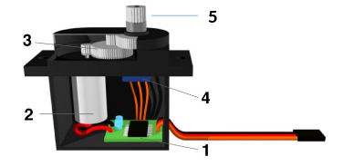

# Servo-Motor

<div align = "center">
<table>
  <thead>
    <tr>
      <th align = "center">Titel</th>
      <th align = "center">Autor</th>
      <th align = "center">Stand</th>
    </tr>
  </thead>
  <tbody>
    <tr>
      <td align = "center">Servo-Motor</td>
      <td align = "center">Eva Brachhhold</td>
      <td align = "center">12.05.2023</td>
    </tr>
  </tbody>
</table>
</div>

Der Servomotor ist ein spezieller elektrischer Motor,  der die Kontrolle der Winkelposition seiner Motorwelle, der Drehgeschwindigkeit sowie der  Beschleunigung erlaubt. Ein Servomotor kann im Gradbereich 0˚ bis 180˚ sehr genau positioniert werden. Die Vorgabe des Winkels erfolgt durch ein Pulsweitensignal. Er ist in der Lage elektrische Energie in mechanische Energie umzuwandeln.

## Table of Contents

- [1. Aufbau eines Servo-Motors](#1-aufbau-eines-servo-motors)
- [2. Anschlüsse am RoboCar](#2-anschlüsse-am-robocar)
- [3. Pulsweitenmodulation (PWM)](#3-pulsweitenmodulation)
- [4. Funktionsweise des Servo-Motors](#4-funktionsweise-des-servo-motors)
- [5. Unser Programm](#5-unser-programm)

---

## 1. Aufbau eines Servo-Motors

- Der Servomotor besteht aus einer Motosteuerung (1), einem Elektromotor (2), einem Getriebe (3) und einem Potentiometer (4).
- Dieser dient der Positionsbestimmung.
- An dem kleinen Zahnrad (5) werden weitere Bauteile befestigt.
- Alles ist in einem robusten Plastikgehäuse untergebracht.

<div align = "center">
  
<p><i>Aufbau eines Servomotors</i></p>
</div>

[^1]

### Elektrische Anschlüsse

- Über den gelben Anschluss werden die Daten der Pulsweitenmodulation an die Motorsteuerung des Servomotors weitergegeben.
- Das rote Kabel stellt den positiven Anschluss VCC am Steckbrett da, das braune den negativen GND. 

<div align = "center">
  
<p><i>Allgemeine Anschlüsse</i></p>
</div>

[^2]

## 2. Anschlüsse am RoboCar

- GND wird am Steckbrett auf der negativen Leiste angeschlossen und ist das braune Kabel.
- Der rote VCC-Anschluss führt zu +5V des Motors L298.
- Das Kabel für das Signal der PWM ist an unserem Auto orange und steckt an dem analogen Anschluss A1 des Arduino bzw. dem digitalen Anschluss D15.

## 3. Pulsweitenmodulation

- Die Pulsweitenmodulation (**PWM**) sendet elektrische Signale an den Servo. 
- Der Pulspegel ist für eine bestimmte Zeit auf HIGH (+5 V) und dann wieder auf LOW (GND).
- Dem Servomotor muss mindestens alle 20 Millisekunden ein Puls gesendet werden.
- Das sind 50 Impulse pro Minute beziehungsweise 50 Hz.
- Entweder man nutzt ein Potentiometer zur Regelung der Impulse oder man programmiert das Pulsweitensignal direkt im Arduin

[^3]

## 4. Funktionsweise des Servo-Motors

- Die elektrischen Impulse werden über ein Pulsweitensignal und die Signalleitung des Servo zur Platine geleitet.
- Auf der Platine wird das elektrische Signal über einen Impulswandler, einen Komparator und schließlich zum Motortreiber geschickt. 
- Dieser treibt den Gleichstrommotor im Servo an.
- Durch eine interne H-Brücken-Steuerung kann die Richtung gewechselt werden.
- Der Motor führt zu einem Getriebe, dass mit einem äußeren Zahnrad verbunden ist, an dem die Bauteile befestigt werden.
- Das eingebaute Potentiometer des Servomotors ist an diesem Ausgang befestigt und verändert durch die Richtungswechsel seinen Widerstand - dieser wird durch den Anschluss am Komparator gemessen und mit dem Pulsweitensignal verglichen.
- Wenn eine Differenz vorliegt, wird der Winkel des Servo korrigiert bis der Ausgleich des Unterschiedes erreicht wurde.

<div align = "center">
  
<p><i>Funktionsweise</i></p>
</div>

[^4] [^5]

## 5. Unser Programm

In unserem Programm `Servo.h` senden wir zum Servomotor nur jede Sekunde einen Impuls um Strom zu sparen. Das bedeutet, dass dem Servomotor eine Sekunde bleibt, um den richtigen Winkel zu stellen. 

Ganz am Anfang haben wir die Variable `lenkWinkel` im Variablentyp `int` definiert. Außdem wurde im `void servoSetup` der Anschluss A1 für den Servo als Ausgang definiert.

```C++
int lenkWinkel = 90;
 
void servoSetup(){
  pinMode(SVP, OUTPUT);
}
```


In der folgenden `void` werden verschiedene Hilfsvariablen definiert.

`Static long timer` ist die Variable für den **Wecker / Timer** der Mikrosekunden. Mit `Static int puls` wird die Zeit des Impulses und der Restlänge gezählt und `static int wiOld` gibt den Winkel vom vorherigen Aufruf wieder. Mit `static int svCnt = 0` wird der Hilfszähler für die 50 Pulse bezeichnet und er zählt von 50 bis 0 runter.

```C++
static long timer;     
static int puls;      
static int wiOld; 
static int svCnt = 0;
```

Im nächsten Abschnitt fängt der Zähler wieder bei 50 an auf 0 zu zählen, sobald der Winkel geändert wurde.

Dann hat der Servo eine Minute (50*20ms) Zeit, den neuen Winkel einzustellen.

Wenn die Minute abgelaufen ist, wird der Motor ausgeschalten um Strom zu sparen. Außerdem bekommt der Servo so nicht die ganze Zeit dasselbe Signal, da er sonst anfangen würde zu zittern oder die Kontrolle zu verlieren.

```C++
if(svCnt>0 || abs(wi-wiOld)>0){
    if(abs(wi-wiOld)>0) {
      svCnt=50;               
      wiOld=wi;
```

Im letzten Teil der Void wird der Wert des Weckers mit dem laufenden Zähler `micros()` aktualisiert. 

Außerdem werden die Spannungswerte für den Servo in Winkel übertragen, der Pulswert auf den Bereich zwischen 500 ms und 2500 ms beschränkt und der Anschluss des Servos auf `HIGH` gesetzt, falls der Puls den Wert von 2,5 ms überschritten hat.
Hier wird der alte Pulswert für „Aus“ festgelegt.

Ansonsten wird der Anschluss auf `LOW` gestellt.

Der neue Pulswert wird dann aus der Differenz von 20.000 ms und dem alten Pulswert gebildet. Daraufhin zählt der Hilfszähler für die Impulse weiterhin runter.

```C++
if(micros()>timer+puls){
      timer = micros();       
      if(puls>2500){          
        digitalWrite(SVP, HIGH);
        puls = map(wi,0,180,500,2500);
      }
      else {                 
        digitalWrite(SVP, LOW);
        puls = 20000-puls;
        svCnt--;
      }
    }
  }
}
```

[^1]: https://starthardware.org/servo/
[^2]: https://edistechlab.com/sg-90-servo-motor/?v=3a52f3c22ed6
[^3]: https://www.exp-tech.de/blog/arduino-tutorial-pulsweitenmodulation-pwm
[^4]: https://kem.industrie.de/elektromotoren/was-sind-servomotoren-und-wie-funktionieren-sie/#slider-intro-1
[^5]: https://www.youtube.com/watch?v=g4BM1pjm64s&t=654s
